# Thiết kế cơ sở dữ liệu quản lý nội bộ THCS Thanh Đạm

## Sơ đồ quan hệ nghiệp vụ chính

```mermaid
erDiagram
    USERS ||--o| TEACHERS : "tài khoản"
    USERS }o--o{ ROLES : "role_user"
    ROLES }o--o{ PERMISSIONS : "permission_role"
    TEACHERS }o--o{ DEPARTMENTS : "teacher_department"
    TEACHERS }o--o{ SUBJECTS : "teacher_subject"
    TEACHERS }o--o{ POSITIONS : "teacher_position"
    ACADEMIC_YEARS ||--o{ SEMESTERS : "gồm"

    USERS ||--o{ TASKS : "tạo/giao"
    TASK_CATEGORIES ||--o{ TASKS : "phân loại"
    TASKS }o--o{ TEACHERS : "task_teacher_assignees"
    TASKS }o--o{ DEPARTMENTS : "task_department_assignees"
    TASKS ||--o{ TASK_UPDATES : "tiến độ"
    TASKS ||--o{ TASK_SUBMISSIONS : "kết quả"
    TASKS ||--o{ TASK_EVALUATIONS : "đánh giá"
    TASK_EVALUATIONS ||--o{ EVALUATION_SCORE_HISTORIES : "lịch sử điểm"

    ACADEMIC_YEARS ||--o{ KPI_FRAMEWORKS : "áp dụng"
    KPI_FRAMEWORKS }o--o{ KPI_CRITERIA : "kpi_framework_criteria"
    KPI_FRAMEWORKS ||--o{ KPI_FRAMEWORK_SCOPES : "phạm vi"
    EVALUATION_PERIODS ||--o{ TEACHER_KPI_RESULTS : "kỳ đánh giá"
    TEACHERS ||--o{ TEACHER_KPI_RESULTS : "kết quả"
    TEACHER_KPI_RESULTS ||--o{ TEACHER_KPI_CRITERION_SCORES : "chi tiết"
    TASKS ||--o{ TASK_KPI_SCORES : "đóng góp KPI"
    TEACHER_KPI_RESULTS ||--o{ KPI_ADJUSTMENTS : "cộng/trừ"
    TEACHER_KPI_RESULTS ||--o| TEACHER_RANKINGS : "xếp hạng"

    FILES ||--o{ FILE_ATTACHMENTS : "đính kèm đa hình"
    FILES ||--o{ SHARED_RESOURCES : "tệp hiện tại"
    SHARED_RESOURCES ||--o{ RESOURCE_VERSIONS : "phiên bản"
    SHARED_RESOURCES ||--o{ RESOURCE_PERMISSIONS : "ACL"
    OFFICIAL_DOCUMENTS }o--o{ TASKS : "document_task"

    TEACHERS ||--o{ LEAVE_REQUESTS : "xin nghỉ"
    LEAVE_REQUESTS ||--o{ APPROVAL_STEPS : "duyệt đa hình"
    TEACHERS ||--o{ TEACHING_SCHEDULES : "lịch dạy"
    LEAVE_REQUESTS ||--o{ SUBSTITUTE_ASSIGNMENTS : "phát sinh"
    TEACHING_SCHEDULES ||--o{ SUBSTITUTE_ASSIGNMENTS : "tiết gốc"
    TEACHERS ||--o{ SUBSTITUTE_ASSIGNMENTS : "dạy thay/bù"

    USERS ||--o{ NOTIFICATIONS : "nhận"
    USERS ||--o{ AI_CONVERSATIONS : "tra cứu AI"
    AI_CONVERSATIONS ||--o{ AI_MESSAGES : "tin nhắn"
    USERS ||--o{ AUDIT_LOGS : "thao tác"
```

## Các miền dữ liệu

| Miền | Bảng chính | Mục đích |
|---|---|---|
| Nhân sự | `users`, `teachers`, `departments`, `subjects`, `positions` | Hồ sơ, tổ/bộ môn, chức vụ và lịch sử công tác |
| Phân quyền | `roles`, `permissions`, `role_user`, `permission_role` | RBAC toàn trường hoặc giới hạn theo tổ |
| Công việc | `tasks`, `task_teacher_assignees`, `task_department_assignees`, `task_updates`, `task_submissions` | Giao cá nhân/nhóm, tiến độ, kết quả và minh chứng |
| Đánh giá | `task_evaluations`, `evaluation_score_histories`, `approval_steps` | Tự đánh giá, tổ trưởng/BGH đánh giá và quy trình duyệt |
| KPI | `kpi_frameworks`, `kpi_criteria`, `teacher_kpi_results`, `task_kpi_scores`, `kpi_adjustments` | Công thức, trọng số, điểm công việc, cộng/trừ và tổng hợp |
| Thi đua | `classification_rules`, `teacher_rankings`, `reward_nominations` | Xếp loại, thứ hạng và đề xuất khen thưởng |
| Kho dữ liệu | `files`, `shared_resources`, `resource_versions`, `resource_permissions` | File tập trung, phiên bản và ACL xem/tải/sửa/xóa |
| Văn bản | `official_documents`, `document_types`, `document_task` | Văn bản đến/đi và nhiệm vụ phát sinh từ văn bản |
| Nghỉ phép | `leave_requests`, `approval_steps` | Đơn nghỉ và phê duyệt nhiều cấp |
| Dạy thay | `classes`, `teaching_schedules`, `substitute_assignments` | Lịch gốc, tiết dạy thay/dạy bù và dữ liệu KPI |
| Hệ thống | `notifications`, `notification_preferences`, `audit_logs` | Nhắc việc, cấu hình kênh nhận và nhật ký thay đổi |
| Chatbot | `ai_conversations`, `ai_messages` | Lưu hội thoại, phạm vi truy cập và bản ghi được tham chiếu |

## Quy ước quan trọng

- Trạng thái lưu bằng chuỗi có index để linh hoạt mở rộng; validation ở tầng Laravel phải giới hạn giá trị hợp lệ.
- `file_attachments`, `approval_steps` và `audit_logs` dùng quan hệ đa hình để tái sử dụng cho nhiều nghiệp vụ.
- `teacher_department`, `teacher_subject`, `teacher_position` có ngày bắt đầu/kết thúc để giữ lịch sử thay vì ghi đè.
- Điểm KPI chi tiết được lưu riêng; `teacher_kpi_results` là bản tổng hợp phục vụ dashboard/báo cáo nhanh.
- `task_status_histories`, `evaluation_score_histories`, `resource_versions` và `audit_logs` đảm bảo khả năng truy vết.
- Các dashboard và báo cáo nên truy vấn từ bảng nghiệp vụ; khi dữ liệu lớn có thể bổ sung materialized summary theo ngày.

## Luồng liên kết tiêu biểu

1. Văn bản (`official_documents`) tạo công việc qua `document_task`.
2. Công việc được giao cho giáo viên/tổ, cập nhật tiến độ và nộp minh chứng.
3. Tự đánh giá, tổ trưởng và BGH ghi vào `task_evaluations`; duyệt qua `approval_steps`.
4. Điểm nhiệm vụ chuyển vào `task_kpi_scores`, cộng với `kpi_adjustments` để tổng hợp `teacher_kpi_results`.
5. Kết quả KPI sinh `teacher_rankings` và có thể tạo `reward_nominations`.
6. Đơn nghỉ được duyệt sẽ sinh `substitute_assignments`; tiết dạy thay hoàn tất có thể được quy đổi thành KPI.

